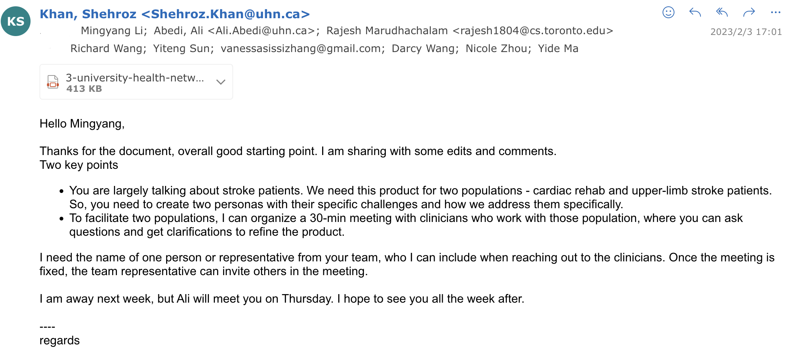

# Team 3 UHN Rehabilitation Remotely
> _Note:_ This document will evolve throughout your project. You commit regularly to this file while working on the project (especially edits/additions/deletions to the _Highlights_ section). 
 > **This document will serve as a master plan between your team, your partner and your TA.**

## Product Details
 
#### Q1: What is the product?
 
We are going to build a responsive website for stroke patients to do rehabilitation exercises remotely. This website will be suitable for both mobile and PC users. This website is going to create a friendly and efficient communication platform for physicians and patients. 
we are going to make the following activities happen through this webste: 

* physicians can view the progress of the patients. Patients are able to watch rehabilitation video exercises
* physicans can record their movement video on the websites.
* physicians can comment on the patients’ movement and set up the next set of rehabilitation exercises. 
* Patients are able to schedule online video meetings to communicate with physicians. 

This website is going to overcome the location barriers for patients that live far from the rehabilitation stations, as well as to overcome the mobility barriers for patients that contain mobility issues with their body after strokes. 
 


#### Q2: Who are your target users?

 We have two type of target users: Patients and Physicians.
 * Patients 
   * Patients who requires rehabilitation regularly with some mobility issues or live too far from the facilities.
   * stroke patients who are unable to attend rehabilitation sessions in person due to lack of accompany members. 

 * Physicians
   * Doctors who wamt to monitor on patients' rehabilitation progress. 
   * Doctors who want to provide feedback to patients by online consultations. 

Patients Persona(Persona 1 - upper-limb stroke patients):
 * Mike is a retired programmer who was recently diagnosed with stroke. He is determined to manage his condition and try to restore physical ability. He wants to stay active, but his condition makes it difficult for him to attend in-person physical therapy sessions.
Mike's family members are also busy with their own work and could not accompany Mike to the rehabilitation center. Mike searched online for remote rehabilitation options and stumbled upon the responsive website built for stroke patients. He was able to access a wide range of exercises, videos, and information tailored specifically for stroke rehabilitation. He could also communicate with his physical therapist remotely through the website, receiving feedback on his progress and adjustments to his treatment plan. Nathan was able to continue his rehabilitation at home, making it more convenient and accessible for him and his family members. The website helped Nathan to overcome the location and mobility barriers and achieve his goal of recovery from stroke.
 * Goals:
    * To access online physical therapy guidance and exercises from home
    * To improve his condition and manage pain through regular exercise
    * To avoid surgery
    * To be able to support their loved one's rehabilitation and recovery from a stroke
    * To have access to reliable and trustworthy information and resources for stroke rehabilitation
    * To be able to communicate with and receive updates from their loved one's physical therapist
    * To have a convenient and accessible way for their loved one to continue rehabilitation at home
 * Frustrations:
    * Difficulty finding online resources that are tailored to his condition
    * Struggling to follow instructions for exercises without hands-on assistance
    * Fear of worsening his condition by doing exercises incorrectly.
    * Difficulty in finding reliable and trustworthy information about stroke rehabilitation
    * Inability to be present at in-person rehabilitation sessions with their loved one
    * Difficulty in communicating with and receiving updates from their loved one's physical therapist
    * Feeling helpless in supporting their loved one's recovery from a stroke
    * feeling overwhelmed with the responsibilities of caring for their loved one.
 * How we address them specifically:
    * Doctor provide videos with clear demonstrations of exercises to minimize the risk of patients doing them incorrectly.
    * real-time communication options.

Patients Persona(Persona 2 - cardiac rehab patients):
 * Zoe is now 50-year-old. She recently had a heart bypass surgery. Now she is looking for a convenient and effective way to manage her rehabilitation at home, without having to visit the physical therapist regularly.
 * Goals:
    * Can choose the training she likes.
    * Can pause the video anytime when she feels tired.
    * To regain her strength and cardiovascular fitness.
 * Frustrations:
    * Some training may be too intense for her. It's hard for her to know what is best training for her.
    * Struggling with lacking of motivation for regular physical activities. 
 * How we address them specifically:
    * The doctor will schedule different intensities of training according to her condition.
    * Our platform also provides regular progress trackings and feedbacks, which can help Zoe stay motivated and focused on her goals.


Health care staff members(Persona3):
 * Dr. Amy is a physiotherapist, who works with patients in her private clinic and also provides online rehabilitation guidance to her patients.
 * goals:
    * To monitor her patients' rehabilitation progress while they are off-site
    * To make necessary adjustments to her patients' treatment plans based on their progress.
    * To provide better guidance to her patients through online video.
 * frustrations:
    * Keeping track of her patients' progress using traditional methods like paper notes
    * Inefficient communication with her patients, as emails or phone calls are not always reliable.
 * How we address them specifically:
    * The platform will record what training the patient has completed.
    * real-time communication options.

#### Q3: Why would your users choose your product? What are they using today to solve their problem/need?

The advantages of our website: 
* including both admin interface and patient interface for both clinic and public users. 
* a responsive website which can be used in multi-devices. 
* Special design icons and accessibility designs for people who have mobility issues and vision issues after expending stroke.
* Providing online consultations with physicans remotely to patients.
* offering video guidance specifically tailored for rehabilitation patients and can provide customized plans based on their needs.
* comenting on patinets' exercise video recordings by physicans.


There is no current product to solve this problem.


#### Q4: What are the user stories that make up the Minumum Viable Product (MVP)?

 * At least 5 user stories concerning the main features of the application - note that this can broken down further
 * You must follow proper user story format (as taught in lecture) ```As a <user of the app>, I want to <do something in the app> in order to <accomplish some goal>```
 * User stories must contain acceptance criteria. Examples of user stories with different formats can be found here: https://www.justinmind.com/blog/user-story-examples/. **It is important that you provide a link to an artifact containing your user stories**.
 * If you have a partner, these must be reviewed and accepted by them. You need to include the evidence of partner approval (e.g., screenshot from email) or at least communication to the partner (e.g., email you sent)


Patients: 
 * User Story 1:
    * As a patient who struggles to stay motivated, I would like to have a physical therapist monitor my progress, so that I can stick to my rehabilitation plan.

 * Acceptance Criteria:
    * As a patient, when I complete an exercise, I am able to submit my “milestone”.
 * User Story 2:
    * As a patient with mobility issues, I would like to access physical therapy guidance remotely, so that I can manage my condition from home.
 * Acceptance Criteria:
    * Given that I am a patient, when I access the online platform, I am able to follow the rehabilitation videos provided by a licensed physical therapist for guidance and support.


 * User Story 3:
    * As a patient, I would like to receive customized exercise plans, so that I can focus on my specific needs and progress efficiently in my rehabilitation.

 * Acceptance Criteria:

    * Given that I have completed my initial assessment, when I log into the platform, I can view a personalized exercise plan based on my medical history and current condition.
    *Given that my rehabilitation progress is being monitored, when my physical therapist updates my exercise plan, I receive notifications and can see the updated plan in my account.


 * User Story 4:
    * As a patient who is not good at using web software, I would like to have a simple and easy-to-use interface, so that I can access the platform without difficulty.

 * Acceptance Criteria:

    * As a patient who is not tech-savvy, when I access the online platform, I am able to navigate and access all the features easily without any technical assistance. The platform should have clear and simple instructions, easy-to-use buttons and functions, and a user-friendly interface. The platform should also have a customer support that can guide and help the user if they have any difficulty. The platform should also consider accessibility features such as larger text and high contrast mode for visually impaired users.

Health Care Staff members: 
 * User story 5:
    * As a doctor, I would like to be able to monitor the progress of my patients' rehabilitation while they are off-site, so that I can provide better guidance and make necessary adjustments to their treatment plan.

 * Acceptance Criteria:
    * Given that a doctor has access to the web page, when they log in, they are able to view a list of their patients and select a patient to view their rehabilitation progress.
    * Given that the doctor wants to make changes to a patient's rehabilitation plan, when they view the patient's information, they are able to make necessary adjustments and send the updated plan to the patient.

## 

#### Q5: Have you decided on how you will build it? Share what you know now or tell us the options you are considering.

Our team  has already determined some of the main features and functionality that the online 

platform will have, including a navigation bar, login feature, a home page that displays 

information related to the patient's recovery process and therapy prescriptions, a feature to 

join virtual therapy sessions, a feature to record sessions, a feature to schedule appointments 

and take notes after each session, a history feature, and a setting feature. We will build the 

front end part basically based on React, Javascript, CSS, HTML5 and some material sources 

to aid us build user-friendly UI/UX. For the Backend, we will typically use Django with a 

database to achieve all functionalities stated above. It's important to note that this is a 

complex task, and requires a lot of resources, planning and testing.


----
## Intellectual Property Confidentiality Agreement 
> Note this section is **not marked** but must be completed briefly if you have a partner. If you have any questions, please ask on Piazza.
>  
**By default, you own any work that you do as part of your coursework.** However, some partners may want you to keep the project confidential after the course is complete. As part of your first deliverable, you should discuss and agree upon an option with your partner. Examples include:
1. You can share the software and the code freely with anyone with or without a license, regardless of domain, for any use.
2. You can upload the code to GitHub or other similar publicly available domains.
3. You will only share the code under an open-source license with the partner but agree to not distribute it in any way to any other entity or individual. 
4. You will share the code under an open-source license and distribute it as you wish but only the partner can access the system deployed during the course.
5. You will only reference the work you did in your resume, interviews, etc. You agree to not share the code or software in any capacity with anyone unless your partner has agreed to it.

**Your partner cannot ask you to sign any legal agreements or documents pertaining to non-disclosure, confidentiality, IP ownership, etc.**

Briefly describe which option you have agreed to.

 * We agree #4 as described above. We can include the work we did on our resume, share the code under an open-source license, and distribute it as we wish, but only the partner can access the system deployed during the course.
 * We also focus on protecting patient and user privacy, especially when it comes to patient data and videos. Ensure that patient and user data is used only within the company.


----

## Teamwork Details

#### Q6: Have you met with your team?
We met in person at the varsity center after the first zoom meeting. We did a skating session and had board games together. 
session and had board games together. 
We shared strengths and weaknesses in both coding techniques and communication skills. 
We also introduced each other about hobbies and personal goals in life. 
our meetings will generally take place online over Zoom.


#### Q7: What are the roles & responsibilities on the team?

Roles:
 * Frontend Development: Frontend development involves building the user-facing part of a website or application, including its design, layout, and interactivity;
 * Frontend Prototyping: create a sample version of a website or application to test and demonstrate its design, functionality, and user experience;
 * Database Management: administration and maintenance of databases, including tasks such as design, creation, security, backup, and recovery;
 * Product Management: development and life cycle of a product, including defining its strategy, roadmap, requirements, and success criteria and communicate with team and partner.

Members:

Mingyang Li:
 * Roles: Frontend Developer, Database Management
 * Strengths:
    1. Databases
    2. Figma
    3. Web
 * Weaknesses:
    1. Java
    2. Deployment
    3. Mobile Development

Canyang Wang
 * Roles:  Frontend Prototyping, Backend Development, Database Management
 * Strengths:
    1. Database
    2. React/ Javascript/ HTML/ CSS
    3. Python
 * Backend
    1. Weaknesses:
    2. Mobile Development
    3. Java

Nicole Zhou:
 * Roles:  Product Management, Frontend development
 * Strengths:
    1. Vue.js
    2. React.js
    3. Node.js/ Javascript
    4. Django
 * Weaknesses:
    1. Docker, CI/CD
    2. Databases

Yide Ma
 * Roles:   Product Management, Frontend development, Frontend Prototyping
 * Strengths:
    1. Design product features
    2. Django
    3. Javascript
    4. Python, Java, C
 * Weaknesses:
    1. Databases

Yiteng Sun
 * Roles:   Backend Development, Database Management
 * Strengths:
    1. Python
    2. HTML/CSS, Javascript, Django, React.js
    3. SQL
 * Weaknesses:
    1. Java, C
    2. Vue.js
    3. Mobile Development

Chengshuo Zhang 
 * Roles: Product Management, Backend development, Database
 * Strengths: 
    * UX Design 
    * Python
    * Django
    * React
 * Weakness:
    * C++, C 
    * Mobile app development

Darcy Wang:
 * Roles: Full stack developement
 * Strengths: 
    * Python
    * React
    * HTML,CSS, Javascript
 * Weakness:
    * Cloud development
    * Mobile app development


#### Q8: How will you work as a team?

 * Two 30-min online meeting per week: 
    * Tuesday 10:00pm-10:30pm: get updates in each part of the project.
    * Friday 10:30pm-11:00pm: divide job and discuss the key tasks for the following weekend.
During the zoom meeting time, we will have 15 min in breakout rooms for specific tasks and 15min in the main room to update key tasks’ progress for the entire group.  

For D1's first meeting, we divided the group into the prototype team with four memebrs and planning writing with three members.
We set a deadline to finshih the design of the website in figma before the second meeting with UHN partner. 
In the second meeting for D1, we had two breakout rooms on zoom for 15min to discuss sub-group topics. Then, we had 15min of the entire group meeting to confim some design features and discuss the team rules for writing the planning document.

  
#### Q9: How will you organize your team?

First of all, we will assign similar workload tasks to each team member according to their strengths, courses they have taken and areas of interest. Before the weekly group meeting, we will list the todo list of our project. In order to improve the communication efficiency of zoom meeting, we will communicate our ideas on the project before the meeting, and we will have a fixed meeting time. As for how our team tracked the progress, one member of our team managed the other six members and ensured the progress and completion of the project in group chat on a regular basis. We will confirm the completeness of the part that each team member is responsible for according to the comments in the pull request and issue on github.
#### Q10: What are the rules regarding how your team works?

**Communications:**
 * Twice a week via Zoom. One within our team, one with our partner.
 * Our project team will discuss the details encountered in the development process at any time in the group chat(discord/Wechat).
 
**Collaboration: (Share your responses to Q8 & Q9 from A1)**
 * We have two group members who will have the role as the project manager. They should formulate the team's implementation plan and communicate it to the team members in each small group in time to complete it on time. As a team member, everyone performs their own duties and tries their best to complete the task within the specified time. If someone in the group encounters difficulties, they should seek help in time, and follow up with each other in real time. Holding a meeting in time to discuss and exchange current progress and future plans is also crucial. As a group, respect, trust, and transparency are essential, and we will implement these fundamentals and apply them to our group projects.
