# Virtural Rehabilitation/TEAM 3
​
> _Note:_ This document is intended to be relatively short. Be concise and precise. Assume the reader has no prior knowledge of your application and is non-technical. 
​
## Description 
- Context:

This is  a responsive website for stroke and cardiovascular patients to do rehabilitation exercises remotely. The application can arrange weekly and daily exercise programs for users, and users can turn on the camera and synchronize training with avatar exercise videos.
- Value behind the application:

This website is going to overcome the location barriers for patients that live far from the rehabilitation stations, as well as to overcome the mobility barriers for patients that contain mobility issues with their body after strokes.
​
## Key Features
 * Patients are able to do daily rehabilitation exercises viturally. 
    * Patients can login their account to see their assinged exercises
    * Patients can choose the avatar gender to do the exercises.
 * Patients are able to record their own exercising videos.
    * Patients can press the record button to do the redording.
 * Patients are able to do online consultation with physicians. 
    * Patients can find their appointments on the calender 
    * Patients can set up their microphone, speaker and camera 
    * Patents can do the meeting with the doctor.
​
## Instructions
   * Login 

   * Home Pop-up 

   * Home/Exercise 

   * Menu

   * Rehab program 

   * Blog 

   * Settings 

   * Contact Us 

   * Meetings

## 👇Demo - please open the URL below in a new browser and follow the instructions below.
Click the URL below to see how the web app works without downloading the code and setting up enviroment:

[UHN Website](https://d2-uhn-be.azurewebsites.net)

## Instructions(Part 1 of 2 - Register part)
- Page 1: By clicking the URL, you will see the login page.
## 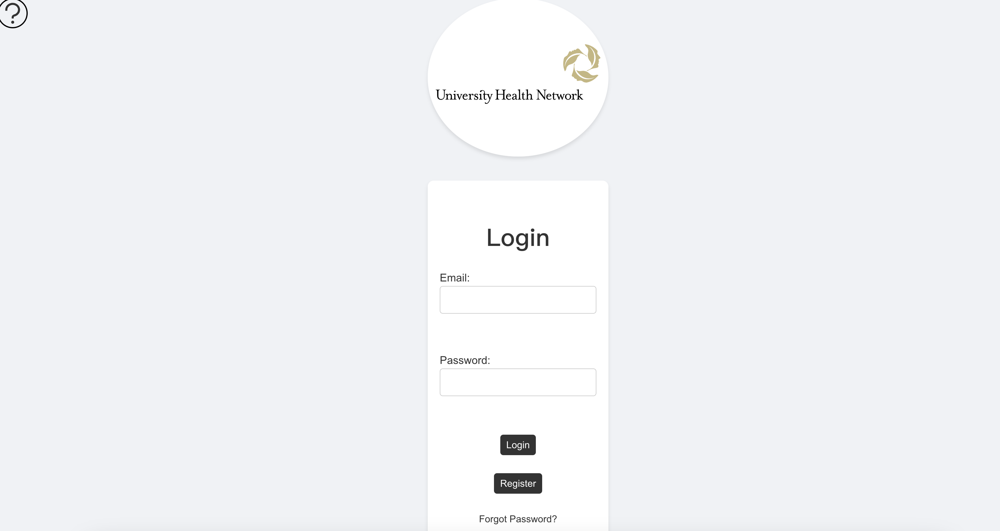

- Page 2: For new user register, click the register button. After entering the correct information, it will go to page 3 for user email verification, you can enter your personal email address to receive the 5-digits vertification code.
## 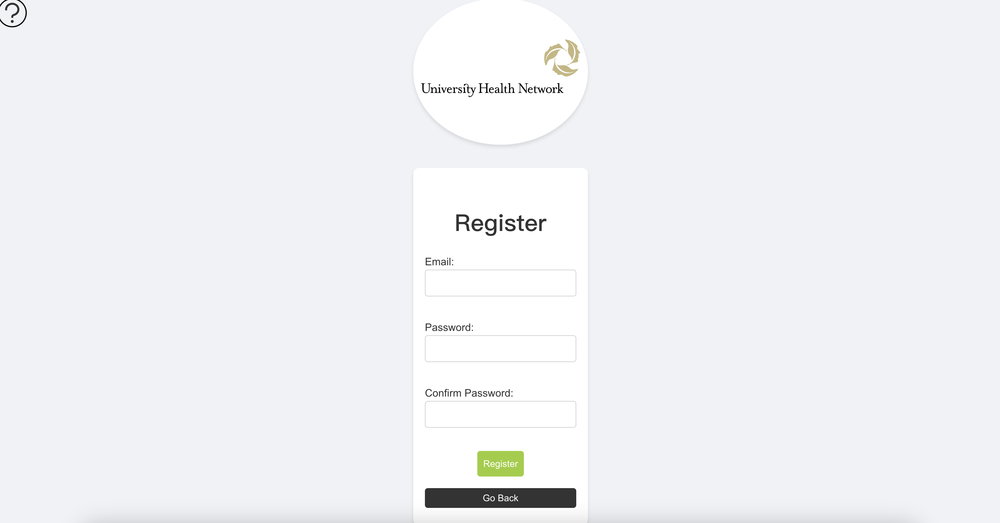

- Page 3: User login email verification, click "login" to access to the main web page.
## 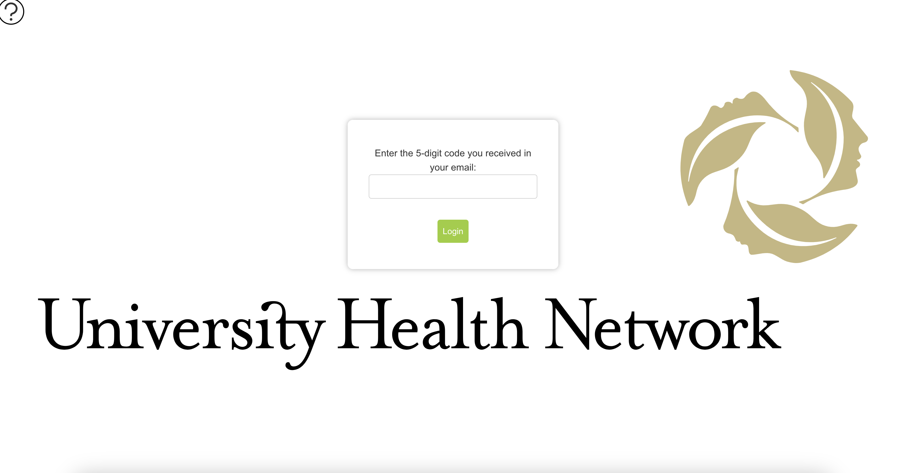

- User will be able to see the main page after login in.

## Instructions(Part 2 of 2 - App features part)
- Page 1:To test the web features, please use our fake user account. Email: zhou@gmail.com, password: 123. Click login to start testing.
## 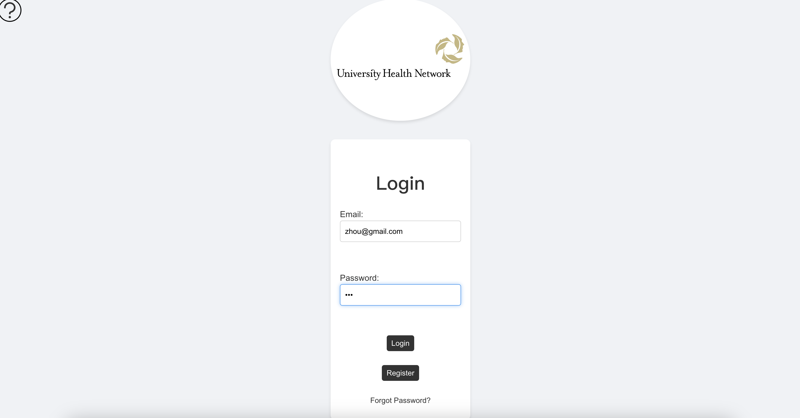

- Page 2: As it is a fake user account, we don't need to enter the 5-digits vertification code, please add "/home" in the URL to access to the home page of the web app.
## 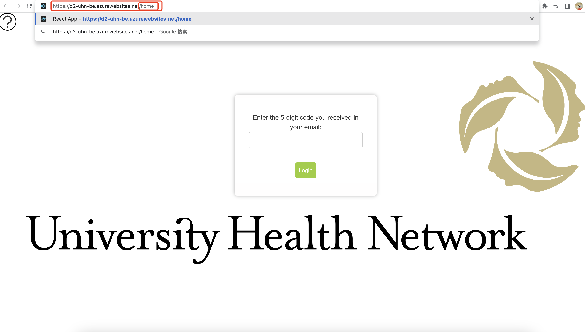

- Page 3: User will be able to go to the home page of the web app. User should be able to see the exercise informaion they have to finish this week.
## 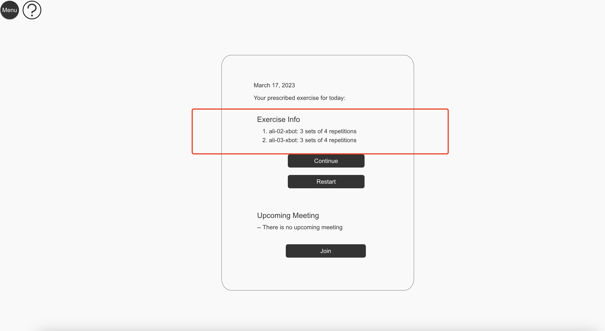

- Page 3.1: Before user starts to do daily rehabilitation exercises, user should click on the "setting" button to check if their devices are working.
## 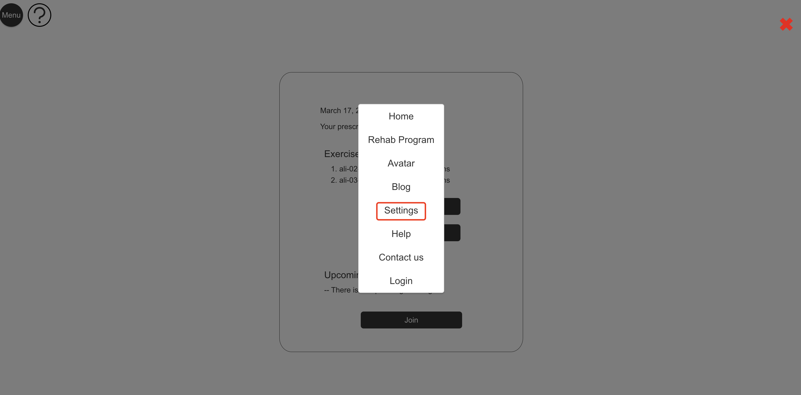
## 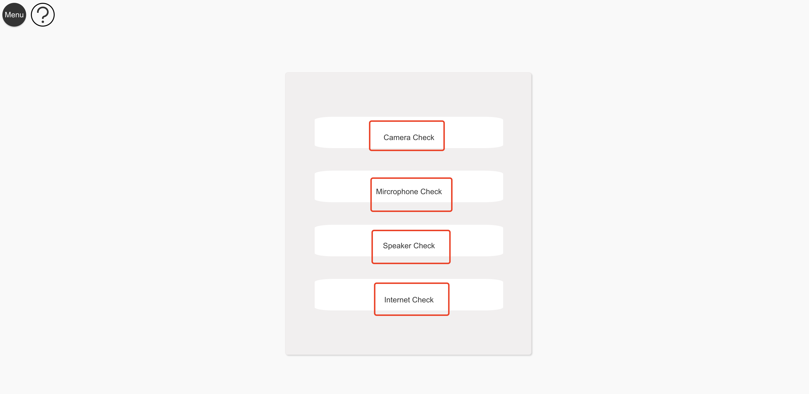
## 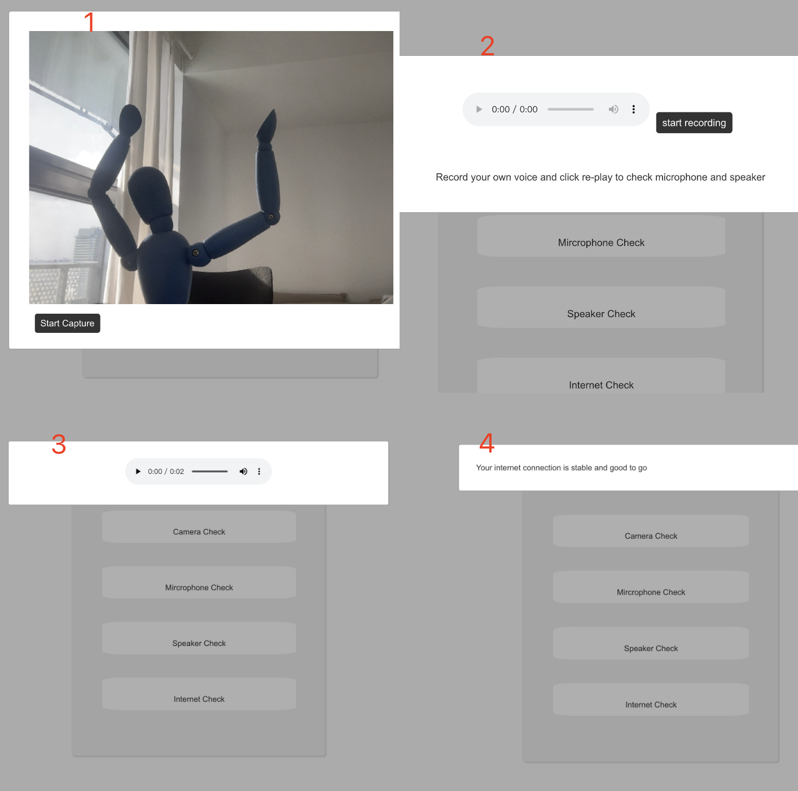

- Page 4: After checking the devices, now user can click on the "Avatar" button to start doing daily rehabilitation exercises.
## 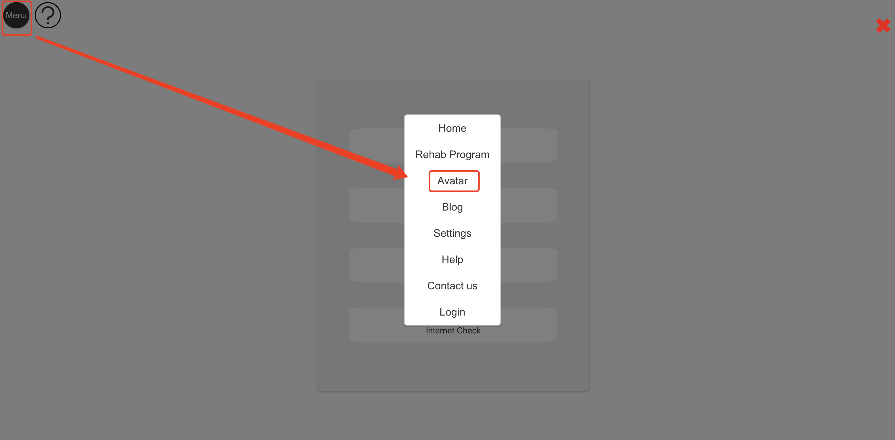

- Page 5: User should click on the "Start recording" button to turn on camera and follow the avatar to do daily rehabilitation exercises. If user want to have a rest, user can lick on the "Stop" button to stop the avatar video and they can continue by clicking "Continue"
## 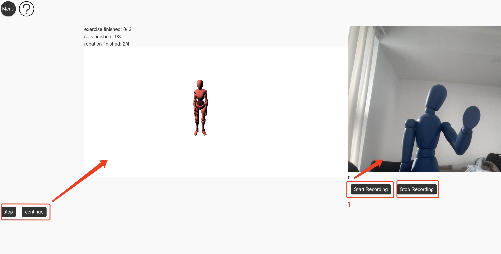

- Page 6: User can click on "Rehab Program" button from "Menu". Users should be able to see the exercises they have done from the calender.
## 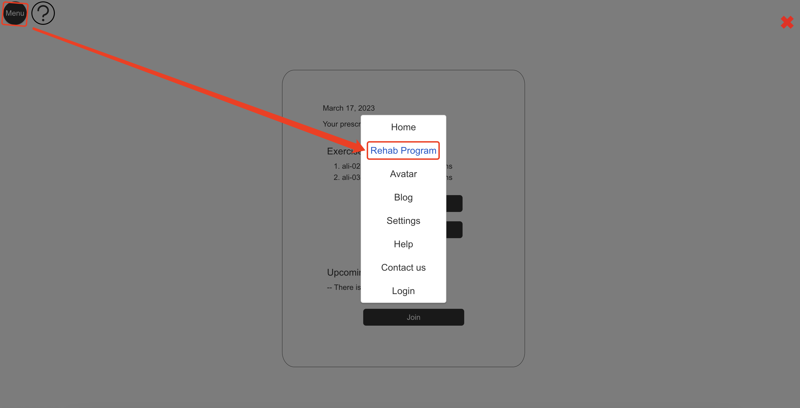
## 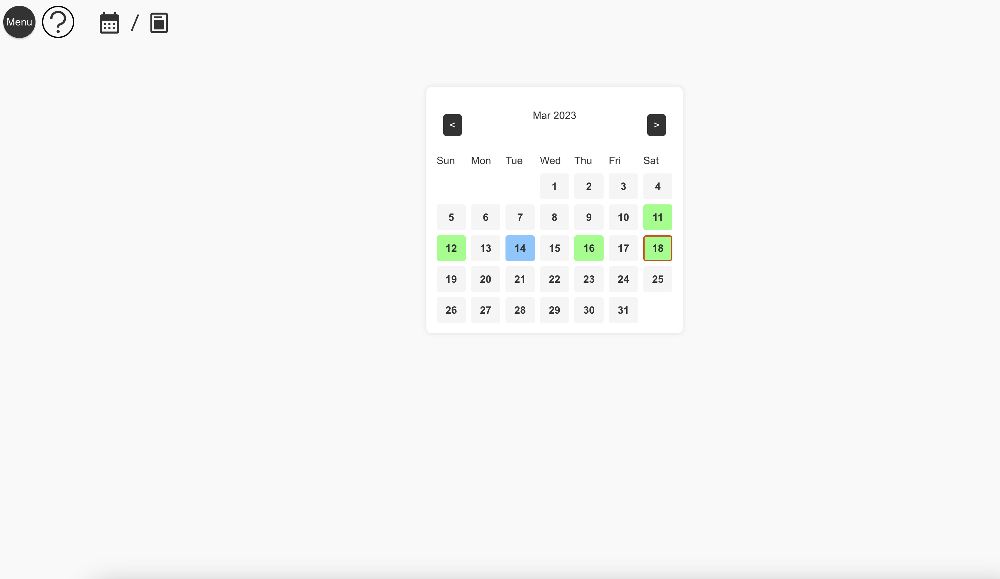

- Page 7: User can also read the blog of the web app, blogs are about about medicine and health. Users are able to click on the blog to read the detail information.
## 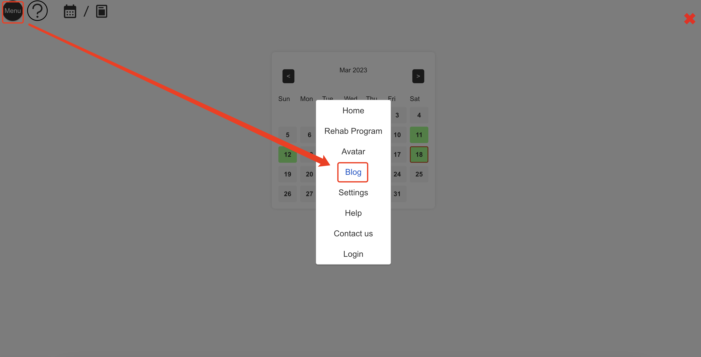
## 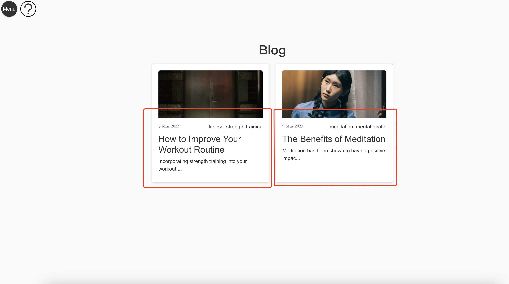


 ## Development requirements
 * What are the technical requirements for a developer to set up on their machine or server (e.g. OS, libraries, etc.)?
 * Briefly describe instructions for setting up and running the application. You should address this part like how one would expect a README doc of real-world deployed application would be.
 * You can see this [example](https://github.com/alichtman/shallow-backup#readme) to get started.
 
#### Method : Install From Source

- Boostrap is the style framework
- React js and Next js will be used to develop the front end
- Node js on Azure is the backend
- PostgreSQL will be the database on Azure

```bash
$ git clone https://github.com/csc301-2023-winter/3-university-health-network-T.git
$ cd Deliverable-2/app/server/
$ npm install
$ npm run devStart
$ cd ..
$ cd Deliverable-2/app/frontend/uhn_project/
$ npm install
$ npm run
```
 
 ## Deployment and Github Workflow
​
## 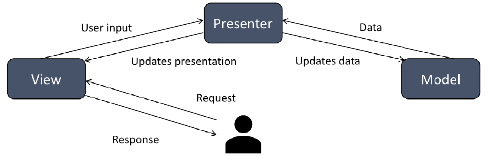

We choose to use  Model-View-Presenter (MVP) to create this virtual rehabilitation website project, we follow the following steps:

* Model: Identify the data and business logic that the website needs to support the virtual rehabilitation program. We need to store user profiles, exercise programs, and progress reports. We create a data model that represents these entities and provides methods for accessing and updating them.

* View: Identify the different views that the website needs to display to users, such as a login page, exercise dashboard, and progress tracking page. Each view should be responsible for rendering data to the user and capturing user input. We create separate classes for each view and define interfaces for them.

* Presenter: The presenter acts as a mediator between the view and model. It processes user input and retrieves data from the model to update the view. We create separate classes for each presenter and define interfaces for them. For instance, we can create a LoginPresenter, ExercisePresenter, and ProgressPresenter.

* Connect the components: Connect the views and presenters using the MVP pattern. Each view should have a reference to its corresponding presenter, and each presenter should have a reference to its corresponding view and model.
Implement the features: Implement the features of the virtual rehabilitation program using the MVP pattern. For instance, we use the LoginPresenter to authenticate users, the ExercisePresenter to display and manage exercise programs, and the ProgressPresenter to track and display user progress.

By using the MVP pattern in our virtual rehabilitation website project, we achieve a clean separation of concerns and improve the maintainability, testability, and scalability of our codebase.

#### Database & Azure (members: Mingyang[Nathan] Li-1005976099-MeeskaM00ska)
Before we start our project, I discussed with our partner about what tables we will need for the database. Then I design a reasonable database with tables and fields. Then I implemented the databse I designed with some pre-set data and push to our group's repo, and also depolyed my database in Azure. After that I talked with our back-end group about the structure of the database and what fields they will need from the tables to let back-end be able to fetch data from database. Other: adjust database info for back-end API testing, depolyed Blob on Azure for front-end video loading and recording.

#### Backend (members: Yide Ma(Tseateen) -- 1005915734 -- mayide1, Yiteng Sun -- 1006750810 -- Haarowww)
   In the early stages of D2, we designed the API according to the requirements and provided it to the front-end. At the same time, we did a preliminary design of the schema for the data that might be needed and discussed it with our partner, receiving feedback. Later, Yide completed the back-end code for the popup, exercise, calendar, recording, and blog-related functions, and tested it with Nathan (a member of the DB team) and Darcy, Nicole, Canyang (members of the FE team), achieving the desired results. The additional APIs in exercise and recording were designed for future functionality expansion.
   
   Yiteng completed the back-end code for accounts(login, register and reset password), send auth code and primary meeting. Also he tested the code with Nathan and Canyang for the functionality. In the future deliverable, the functions in meeting will be finished and updated.
#### Frontend (members: Hanzhi(Nicole）Zhou--1006843196-nzhou27, Canyang Wang -- 1006931652, chengshuo zhang -- vanessa-sissi)

  For the frontend, we divided our project tasks by function similarity, for example, meetings and avatar/rehab recording page have relatively similar function and are likely to use similar tools for development, so these tasks are paired up together. After dividing all tasks into groups, we assess each members' interest in them, and assign the task either to one member for normoal task or a pair of members for harder tasks. Also during the development, we found some unreasonable UI design prototype and talked about them with our partner, and finally we end up with a more user friendly one. For example, the blog will automately show up different beautiful pictures to decorate each blog。
  
  After the draft development, we meet up again and discuss the difficulties we are facing and try to help each other for the occuring problems or bugs. At the same time, we also inform each other with bugs we have found on their own part that needs to be fixed. Also we have a meeting with backend members to talk about the fetch between frontend and backend. During the meeting, we also tested the fetch to make sure our project works well.
  
  On the second revision, we start to test out these functionalities that are developed, this help us to find issues that are not thought of by ourselves.
  
  At the end, we set all the css styling to unify the look of our webpage and deploy the website to cloud.
​
 ## Licenses 
 
The Academic Free License v3.0 (afl-3.0) should be a good choice for our project.
According to the description of this license on the webpage "https://choosealicense.com/licenses/afl-3.0/", it allows for academic and commercial use, modification, and distribution of software under certain conditions. This aligns well with the nature of our partner company and the purpose of this project, which is to facilitate better and faster recovery for more patients. Therefore, we believe that afl-3.0 is a very good choice.
