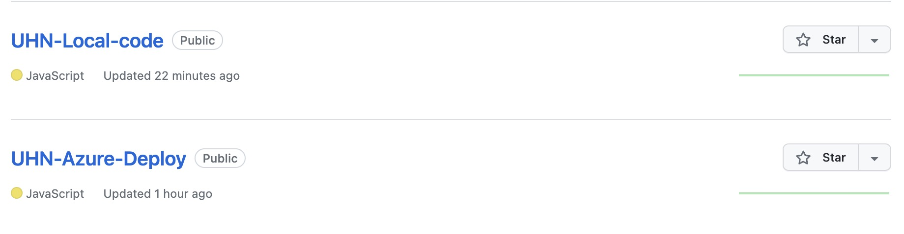
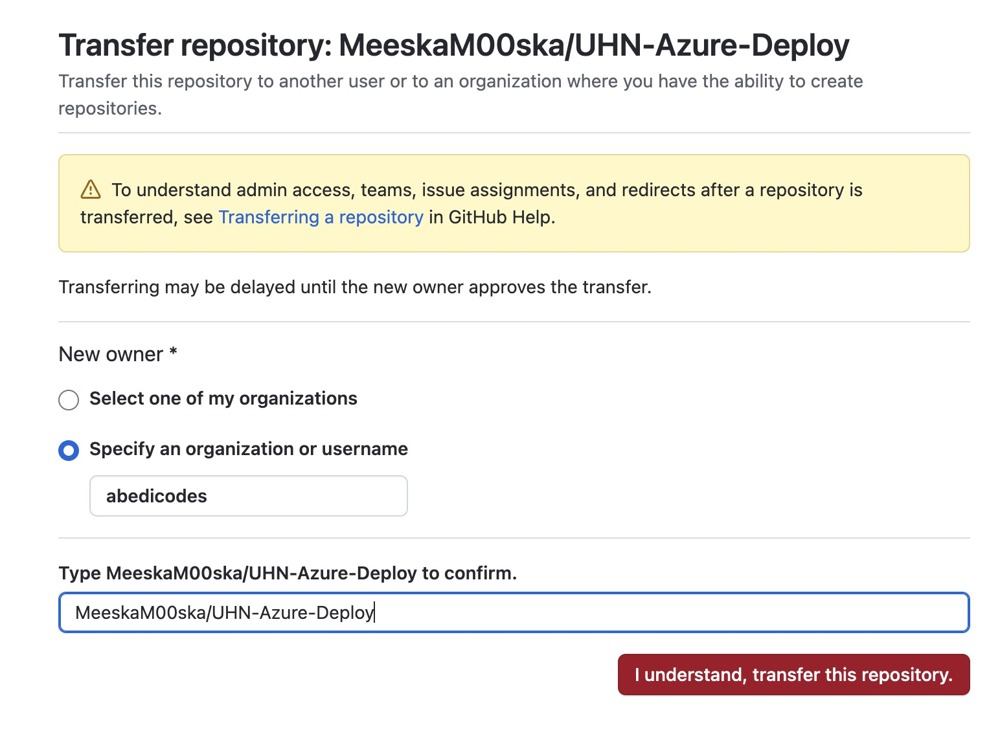
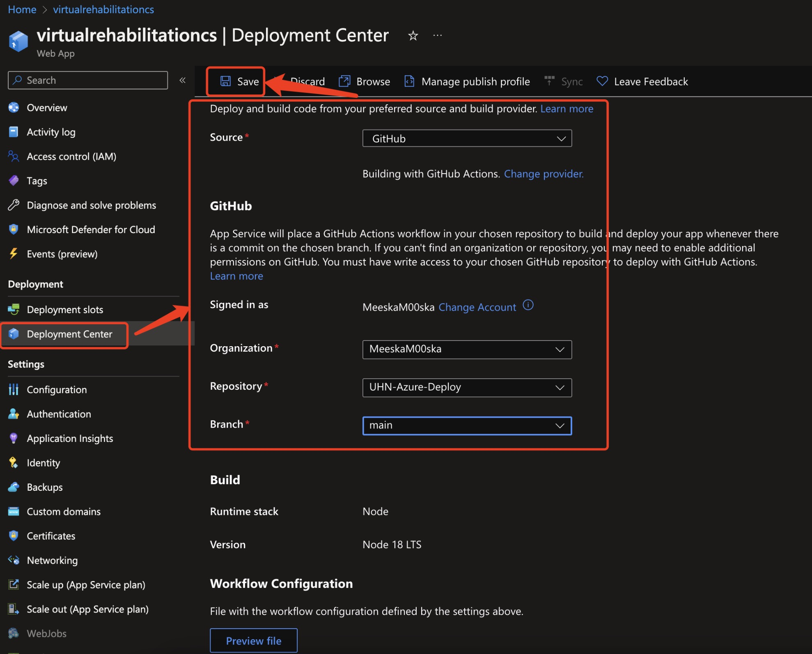

# Virtural Rehabilitation/TEAM 3

## A link to demo video

[Video link](https://virtualrehabilitationcs.azurewebsites.net)

## Description 
- What we have completed for the project:
  * Account register/sign in
  * Email authentication
  * Avatar video
  * Record video from camera
  * Joints detection
  * Joints movement recording
  * Calendar
  * Exercise history
  * Meeting history
  * Help page
  * Meeting

- What is remaining:
  * Record meeting

## Transfer of ownership to your partner of your repo, cloud accounts, and everything else needed for your partner to continue working on or running the software
- Page 1: We ready two repos and both of them will be transfter to our partner, repo1 is for local version, repo2 is for Azure deploy version.
- Reason: Github action will deploy the code automatically once the code is push in the repo(usually takes 15-20 mins), so user can finish coding locally and then transfer all files in the repo2 to reduce the time. 
## 

- Page 2: we will transfer these two repos to our partner with githubid "abedicodes", the readme.md and demo instruction also included in the repo
## 

- Page 3: remember to change the source path in Azure after accepting the transfer repos, you should change it in Azure deployment center
## 

## A set of links, assets and credentials (shared via a secure method and not in an email) to any systems you used (e.g. Github, deployment tools, URLs for deployed products, documentation, etc.)
- Link of the UHN-Web-App:
[Web-app Link](https://virtualrehabilitationcs.azurewebsites.net)

## Confirmation that you have applied the correct license to the repository
The Academic Free License v3.0 (afl-3.0) should be a good choice for our project.
According to the description of this license on the webpage "https://choosealicense.com/licenses/afl-3.0/", it allows for academic and commercial use, modification, and distribution of software under certain conditions. This aligns well with the nature of our partner company and the purpose of this project, which is to facilitate better and faster recovery for more patients. Therefore, we believe that afl-3.0 is a very good choice.

## The offer of a brief virtual meeting or phone call to ensure the partner is comfortable with the information and can take over your project

## Any other details or steps pertinent to taking over the project
[Presentation slides on March 30]([https://virtualrehabilitationcs.azurewebsites.net](https://docs.google.com/presentation/d/1fnz0nvbl-uW0WusXs9Fl6p0om0zxnza8Rmo6h19UglM/edit?usp=sharing))
